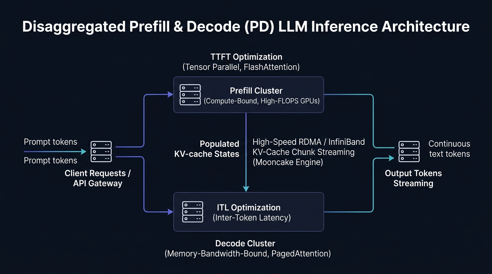

# ⚡ tp-disaggregated-serving: Disaggregated Prefill & Decode Serving Studio

Production-ready architecture for **Disaggregated Prefill and Decode (PD Disaggregation)** in large-scale LLM inference (vLLM, Mooncake KV-Transfer, RoCEv2/InfiniBand RDMA).

🔗 **Interactive Studio:** [talaripradeep.info/tools/disaggregated-prefill-decode/](https://talaripradeep.info/tools/disaggregated-prefill-decode/)



## Overview

Traditional LLM inference co-locates prompt computation (prefill) and token generation (decode) on the same GPU. This causes severe memory bandwidth starvation, pipeline bubbles, and high tail latencies.

**Disaggregated Serving** separates:
1. **Prefill Nodes**: Compute-bound nodes optimized for high FLOPS (NVIDIA H100) to minimize Time-to-First-Token (TTFT).
2. **Decode Nodes**: Memory-bandwidth-bound nodes optimized for high KV-cache capacity (L40S / A100) to minimize Inter-Token Latency (ITL).
3. **Mooncake RDMA Transport**: Zero-copy streaming of populated KV-cache tensors over RoCEv2 / InfiniBand fabrics.

## Quickstart

```bash
docker compose up -d
pip install httpx fastapi uvicorn
python pd_disaggregated_router.py
```

## Production Kubernetes Deployment

```bash
kubectl apply -f k8s-disaggregated-serving.yaml
```

## License

MIT © 2026 Talari Pradeep
